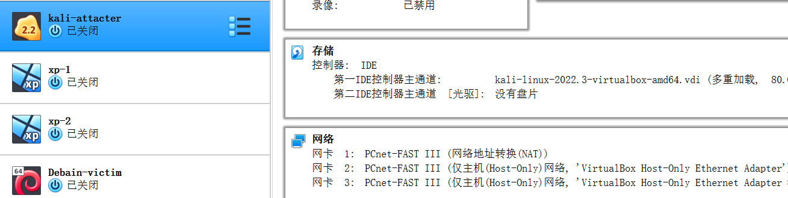

## chapter one

### 实验目的

- 掌握 VirtualBox 虚拟机的安装与使用；
- 掌握 VirtualBox 的虚拟网络类型和按需配置；
- 掌握 VirtualBox 的虚拟硬盘多重加载；

### 实验环境

以下是本次实验需要使用的网络节点说明和主要软件举例：

- VirtualBox 虚拟机
- 攻击者主机（Attacker）：Kali Rolling 2019.2
- 网关（Gateway, GW）：Debian Buster
- 靶机（Victim）：From Sqli to shell / xp-sp3 / Kali

### 实验内容

##### 准备阶段

- 在自己的 Virtualbox 虚拟机里下载并安装 最新版 Kali 的虚拟机镜像版

- 在自己的 Virtualbox 虚拟机里下载并导入 Debian 10 和 Windows XP SP3 的虚拟硬盘文件。

##### 多重加载

[参考资料](https://blog.csdn.net/jeanphorn/article/details/45056251)

完成准备:

##### 网卡配置

网关网卡配置
 
  - NAT网络
  - Host-Only网络
  - intnet 1
  - intnet 2
  
  

kali-victim 和 xp-1 属于同一个内部网络
网卡配置均为intnet1

Debain 和 xp-2 属于同一个内部网络
网卡配置均为intnet2

攻击者kali-attacker的网络配置为
  

##### 网络连通性测试

- 各类主机及其ip地址
  各类系统查看IP地址的指令是：
  > windows XP : ipconfig
  > kali ：ifconfig
  > debain : ip addr show

|  主机名  |       ip       |
| -------- | -------------- |
|  xp-1    | 172.16.111.133 |
|  xp-2    | 172.16.222.106 |
| debain-victim | 172.16.222.103 |
| kali-attackter| 10.0.2.15 |
| kali-victim | 172.16.111.126 |

- 靶机可以直接访问攻击者主机
  内部网络1
  
  
  内部网络2
  
  

- 攻击者主机无法直接访问靶机
  内部网络1
  
  内部网络2
  

- 网关可以直接访问攻击者主机和靶机
  
  访问攻击者主机
  
  访问靶机
  

- 靶机的所有对外上下行流量必须经过网关
  
- 所有节点均可以访问互联网
  网关可正常访问互联网
  
  kali-attacker
  
  kali-victim
  
  xp-1
  
  xp-2
  

##### 问题
- 网关不能正常访问xp