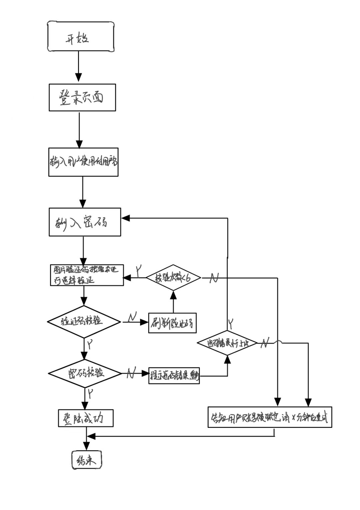

## homework2

### 1.生物特征身份认证方式有哪些？优缺点分析？应用场景举例。

#### 指纹识别
  
- 优点：
  （1）指纹是人体独一无二的特征，并且它们的复杂度足以提供用于鉴别的足够特征。
  （2）如果想要增加可靠性，只需登记更多的指纹，鉴别更多的手指，最多可以达到十个，而每一个指纹都是独一无二的。
  （3）扫描指纹的速度很快，使用非常方便。
  （4）读取指纹时，用户必须将手指与指纹采集头互相接触，与指纹采集头直接接触是读取人体生物特征最可靠的方法，这也是指纹识别技术能够占领大部分市场的一个主要原因。
  （5）指纹采集头可以更加小型化，并且价格会更加低廉。
- 缺点：
  （1）某些人或某些群体的指纹因为指纹特征很少，故而很难成像。
  （2）过去因为在犯罪记录中使用指纹，使得某些人害怕“将指纹记录在案”。然而，实际上现在的指纹鉴别技术都可以保证不存储任何含有指纹图像的数据，而只是存储从指纹中得到的加密的指纹特征数据。
  （3）每一次使用指纹时都会在指纹采集头上留下用户的指纹印痕，而这些指纹痕迹存在被用来复制指纹的可能性。

- 应用场景举例：
  
  1）在计算机上将指纹识别与传统身份认证相结合，防止密码忘记或被别人窃取时产生的安全威胁；
  2）公司等机构对管理人员进行授权和身份认证、考勤等。

#### 声音识别

- 优点：
  1）蕴含声纹特征的语音获取方便、自然，声纹提取可在不知不觉中完成，因此使用者的接受程度也高；
  2）获取语音的识别成本低廉，使用简单，一个麦克风即可，在使用通讯设备时更无需额外的录音设备；
  3）适合远程身份确认，只需要一个麦克风或电话、手机就可以通过网路（通讯网络或互联网络）实现远程登录；
  4）声纹辨认和确认的算法复杂度低；
  5）配合一些其他措施，如通过语音识别进行内容鉴别等，可以提高准确率；……等等。这些优势使得声纹识别的应用越来越收到系统开发者和用户青睐，声纹识别的世界市场占有率15.8%，仅次于指纹和掌纹的生物特征识别，并有不断上升的趋势。
- 缺点：
  1）同一个人的声音具有易变性，易受身体状况、年龄、情绪等的影响；
  2）不同的麦克风和信道对识别性能有影响；
  3）环境噪音对识别有干扰；
  4）混合说话人的情形下人的声纹特征不易提取

- 应用场景举例：
  1）主要在输入场景，如输入法、会议/法院庭审时的实时字幕上屏；
  2）与麦克风阵列和语义结合的人机交互场景

#### 视网膜识别

- 优点：
  1）视网膜是一种极其固定的生物特征，因为它是“隐藏“的，故而不可能磨损，老化或是为疾病影响。
  2）使用者不需要和设备进行直接的接触
  3）是一个最难欺骗的系统因为视网膜是不可见的，故而不会被伪造。

- 缺点：
  1）视网膜技术未经过任何测试。
  2）很明显，视网膜技术可能会给使用者带来健康的损坏，这需要进一步的研究。
  3）对于消费者，视网膜技术没有吸引力
  4）很难进一步降低它的成本 。

- 应用举例：
  1）车载平视显示器，可将重要的驾驶信息投射在汽车的前风挡玻璃上，司机平视就可以看到，从而可以提高行车安全
  2）此外还可为执行军事任务的士兵提供最优路径和战术信息，并且在医疗手术、浸入式游戏行业也大有作为。

#### 虹膜识别

- 优点：
  1）便于用户使用；
  2）可能会是最可靠的生物识别技术；
  3）不需物理的接触；
  4）可靠性高。

- 缺点：
  1）很难将图像获取设备的尺寸小型化；
  2）设备造价高，无法大范围推广；
  3）镜头可能产生图像畸变而使可靠性降低；
  4）两大模块：硬件和软件；
  5）一个自动虹膜识别系统包含硬件和软件两大模块：虹膜图像获取装置和虹膜识别算法。分别对应于图像获取和模式匹配这两个基本问题。

- 应用举例：
  1）考勤和打卡
  2）公安刑侦-虹膜建库
  3）机场高铁-人证核验
  4）监狱看守所-门禁管理
  5）三非管理-不明外来人口管理
  6）银行高端系统-金库安保

#### 面部识别

- 优点：
  1）使用方便，用户接受度高人脸识别技术使用通用的摄像机作为识别信息获取装置，以非接触的方式在识别对象未察觉的情况下完成识别过程。
  2）直观性，利用人脸无疑是肉眼能够判别的最直观的信息源，方便人工确认、审计，“以貌取人”符合人的认知规律。
  3）识别精确度高，速度快与其它生物识别技术相比，人脸识别技术的识别精度处于较高的水平，误识率、拒认率较低。
  4）不易仿冒，人脸识别技术所独具的活性判别能力保证了他人无法以非活性的照片、木偶、蜡像来欺骗识别系统。这是指纹等生物特征识别技术所很难做到的。
  5）基础资料易于获得
  6）成本较低，易于推广使用由于人脸识别技术所使用的是常规通用设备，价格均在一般用户可接受的范围之内，与其它生物识别技术相比，人脸识别产品具有很高的性能价格比。

- 缺点：
  最主要的困难主要是面部作为生物特征的特点所带来的。
  1）相似性不同个体之间的区别不大，所有的面部的结构都相似，甚至面部器官的结构外形都很相似。这样的特点对于利用面部进行定位是有利的，但是对于利用面部区分人类个体是不利的。
  2）易变性面部的外形很不稳定，人可以通过脸部的变化产生很多表情，而在不同观察角度，面部的视觉图像也相差很大，另外，面部识别还受光照条件（例如白天和夜晚，室内和室外等）、面部的很多遮盖物（例如口罩、墨镜、头发、胡须等）、年龄等多方面因素的影响。
  3）在面部识别中，第一类的变化是应该放大而作为区分个体的标准的，而第二类的变化应该消除，因为它们可以代表同一个个体。通常称第一类变化为类间变化，而称第二类变化为类内变化。对于面部，类内变化往往大于类间变化，从而使在受类内变化干扰的情况下利用类间变化区分个体变得异常困难。

- 应用举例
  1）安保领域。目前大量的企业，住宅，社区，学校等安全管理越来越普及，人脸门禁系统已经成为非常普及的一种安保方式。
  2）通行领域。很多城市的火车站已经安装了面部识别通行设备，进行人证对比过检，有些城市的地铁站也可以通过面部识别的方式进行地铁进出站通行。
  3）泛娱乐领域。现在市场上火爆的美颜相机，网络直播，短视频等都是建立在面部识别的基础上对人脸进行美颜和特效处理。

#### 静脉识别

- 优点：
  1）属于内牛理特征，不会磨损，较难伪造，具有很高安全性。
  2）血管特征通常更明显，容易辨识，抗干扰性好。
  3）可实现非接触式测量，卫生性好，易于为用户接受。
  4）不易受手表面伤痕或油污的影响。

- 缺点
  1）手背静脉仍可能随着年龄和生理的变化而发生变化，永久性尚未得到证实
  2）虽然可能性较小，但仍然存在无法成功注册登记的可能。
  3）由于采集方式受自身特点的限制，产品难以小型化。
  4）采集设备有特殊要求，设计相对复杂，制造成本高。

- 应用举例
  1）指静脉识别+校园智能门禁，引入高安全级别的智能门禁，建立安全可靠的校园进出管理流程；与安防系统集成，整体提升校园安防管理水平。
  2）采用手指静脉识别技术，考试将不再出现替考、代考现象；社保也不再出现冒领及死亡后仍旧领取的问题。指静脉识别技术提供了真正的安全、公正、公平的保障。

### 2.“找回口令功能”和“忘记密码”在访问授权机制中的意义？请尝试设计几种安全的“找回口令功能”，详细描述找回口令的用户具体操作过程。

意义：
  在保证授权的情况下，方便用户的使用。

- 请尝试设计几种安全的“找回口令功能”，详细描述找回口令的用户具体操作过程。

  1.进行安全问答：
  通过最开始进行注册时，用户自行设置的安全问答问题，比如我最喜欢的颜色、最喜欢的cp等，来确定用户身份。
  2.通过邮件来进行验证：
  当用户申请找回口令是，系统随机生成一个MD5唯一的随机字串，放置在数据库中，然后设置时间上线，给用户注册时使用的邮箱发送文件，其中包含MD5的字串和链接，用户通过点击链接来确认身份，重新设置新的口令
  3.使用验证码：
  后台随机生成一个验证码，有效时间设置较小，当用户申请时，就由后台随机发送这个验证码，用户需要在有效期内，输入验证码，进行验证。

### 3.绘制用户使用用户名/口令+图片验证码方式录系统的流程图。考虑认证成功和失败两种场景，考虑授权成功和失败两种场景。

### 4.Windows XP / 7 中的访问控制策略有哪些？访问控制机制有哪些？

访问控制策略包括入网访问控制策略、操作权限控制策略、目录安全控制策略、属性安全控制策略、网络服务器安全控制策略、网络监测、锁定控制策略和防火墙控制策略等7个方面的内容。

常见的访问控制机制有 4 种：DAC、role-BAC、rule-BAC、MAC

### 5.用权限三角形模型来理解并描述下 2 种威胁模型：提权、仿冒。

提权：顾名思义提高用户权限。用户关联相关角色，角色有对应的权限，这样避免了每一次添加新的用户，都需要一步一步绑定权限。可以通过绑定更高级角色的方式来提高用户权限

仿冒：模仿某个用户，仿冒其身份，从而可以绑定其对应的角色，获得某些权限。