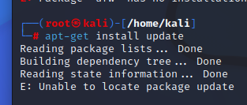

## 基于Scapy编写端口扫描器

### 实验目的
 掌握网络扫描之端口状态探测的基本原理

### 实验过程

##### 网络拓扑

|GateWay|kali-attacker|kali-victim|
|-------|-------|------|
|172.16.111.1|172.16.111.148|172.16.111.121|

##### 端口状态设置
- 进入root
  > su root

- 查看当前防火墙的状态和现有规则
  >ufw status

- 关闭状态：对应端口没有开启监听，防火墙没有开启
  >ufw disable

- 开启状态：对应端口开启监听，防火墙处于关闭状态
  
  apache2基于TCP，在80端口提供服务
  >systemctl start apache2 # port 80

  DNS服务基于UDP，在53端口提供服务
  >systemctl start dnsmasq # port 53

- 过滤状态：对应端口开启监听，防火墙开启
  >ufw enable && ufw deny 80/tcp
  >ufw enable && ufw deny 53/udp

##### TCP connect scan

- 代码

```
 #！ /usr/bin/python

from scapy.all import *

src_port = RandShort()
dst_ip = "172.16.111.148"
dst_port=80

resp = sr1(IP(dst=dst_ip)/TCP(sport=src_port,dport=dst_port,flags="S"),timeout=10)

if resp is None:
    print("Filtered")
elif(resp.haslayer(TCP)):
    if(resp.getlayer(TCP).flags == 0x12):
        print("open")
    elif(resp.getlayer(TCP).flags == 0x14):
        print("Closed")
```


在kali-victim中编写代码，保存为tcp_connect_scan.py文件：


- Closed
  attacker防火墙关闭：
  

  attacker关闭80端口的监听：
  
  在victim上运行代码，并查看结果：
  

  在attacker上抓取数据包：
  

  分析数据包：(由于接受到了[RST,ACK]数据包，说明80端口处于关闭状态)
  

  - nmap复刻：
    

- open
  
  attacker防火墙关闭，开启80端口监听：
  >systemctl start apache2 # port 80

  
  

  在victim上运行代码：
  

  在attacker上抓取分析数据包：
  >tcpdump -i eth1 -w tcp_connect_close.pcap

  > tshark -r tcp_connect_close.pcap -Y "tcp or udp or icmp"

  

  - nmap复刻结果
    

- filtered
  
  attacker开启防火墙，并过滤80端口：
  >ufw enable && ufw deny 80/tcp

  

  在victim运行代码，查看结果：
  >sudo python tcp_connect_scan.py

  

  在attacker-kali抓取并分析数据包：
  

  只收到一个TCP包，说明80端口处于过滤状态

  - nmap复刻结果：
  

#### TCP Xmas scan

- 代码
```
  #! /usr/bin/python

  from scapy.all import *

  dst_ip = "172.16.111.148"
  dst_port = 80

  resp = sr1(IP(dst=dst_ip)/TCP(dport=dst_port,flags="FPU"),timeout=10)

  if resp is None:
    print("open|Filtered")

  elif(resp.haslayer(TCP)):
    if(resp.getlayer(TCP).flags == 0x14):
      print("Closed")

  elif(resp.haslayer(ICMP)):
    if(int(resp.getlayer(ICMP).type)==3 and int(resp.getlayer(ICMP).code) in [1,2,3,9,10,13]):
      print("Filtered")
```
在虚拟机victim上写下如上代码，并保存为tcp_xmas_scan.py文件：

> vim /home/kali/tcp_xmas_scan.py

再输入'i'进入编辑模式，编辑完成后按Esc退出编译模式，再保存退出

  
- Closed
  
防火墙关闭，80端口未开启监听：


在victim上运行代码：


在attacker上抓取并分析数据包：
>tcpdump -i eth1 -w tcp_xmas_closed.pcap

>tshark -r tcp_xmas_closed.pcap -Y "tcp or udp or icmp"


可以看到[RST,ACK]数据包，说明端口关闭

nmap复刻结果：


- open
  
关闭防火墙，80窗口开启监听：


在victim上运行代码：


在attacker上抓取分析数据包：
>tcpdump -i eth1 -w tcp_xmas_open.pcap

>tshark -r tcp_xmas_open.pcap -Y "tcp or udp or icmp"


kali-attacker收到一个TCP包，没有响应，说明端口处于开启/过滤状态

nmap复刻结果：


- Filtered
  
kali-attacker防火墙开启，并过滤80端口：


在kali-victim运行代码


在attacker抓取分析数据包：
>tcpdump -i eth1 -w tcp_xmas_filtered.pcap

>tshark -r tcp_xmas_filtered.pcap -Y "tcp or udp or icmp"


kali-attacker只收到一个TCP包，没有响应，说明端口处于过滤或开启状态

nmap复刻结果：


#### UDP scan

- 代码

```
from scapy.all import *


dst_ip = "172.16.111.148"

dst_port = 53


resp = sr1(IP(dst=dst_ip)/UDP(dport=dst_port),timeout=10)


if resp is None:

    print("open|Filtered")


elif(resp.haslayer(UDP)):

    print("open")


elif(resp.haslayer(ICMP)):

    if(int(resp.getlayer(ICMP).type==3 and int(resp.getlayer(ICMP).code==3):

           print("Closed")

    elif(int(resp.getlayer(ICMP).type)==3 and int(resp.getlayer(ICMP).code) in [1,2,9,10,13]):

           print("Filtered")

```

在kali-victim上写入代码，并保存为udp_scan.py文件


- Closed

防火墙关闭，53端口未开启监听：


在victim上运行代码：


在attacker上抓取分析数据包：
>tcpdump -i eth1 -w udp_scan.pcap

>tshark -r udp_scan.pcap -Y "tcp or udp or icmp"


attacker发送了ICMP不可达数据包，说明端口处于关闭状态

nmap复刻结果：
> sudo nmap -sU -p 53 172.16.111.148


- Open

安装dnsmasq.service,防火墙关闭，53窗口开始监听：


在victim运行代码：


抓取分析数据包：


kali-attacker接受了kali-victim发送的udp数据包并发送了响应包，说明端口处于开启状态

nmap复刻：


- Filtered

开启防火墙并过滤经过53端口的所有包：
>ufw enable && ufw deny 53/udp


在victim上运行代码,并在attacker上抓取分析数据包:


attacker接收到victim发送的udp数据包,但没有做出回应,说明端口处于过滤状态

nmap复刻:


#### 问题

- su root不能切换root,提示
  >su: Authentication failure
  解决办法：
  >sudo passwd root
  下次再su的时候只要输入密码即可成功登录

  

- ufw安装报错
  尝试'apt-get install ufw'，报错提示软件包缺失
  尝试更新软件列表
  >apt-get install update

  
  更换源
  >vi /etc/apt/sources.list

  输入i进入编辑模式,输入下面两行
  >deb http://mirrors.aliyun.com/kali kali-rolling main non-free contrib
  >deb-src http://mirrors.aliyun.com/kali kali-rolling main non-free contrib

  然后点击ESC进行退出编辑操作，然后输入':wq'保存退出
  继续更新软件源，成功
  [参考资料](https://blog.csdn.net/m0_55793759/article/details/126410613)

- vim相关操作
  [参考资料](https://blog.51cto.com/kisuntech/1317294)

